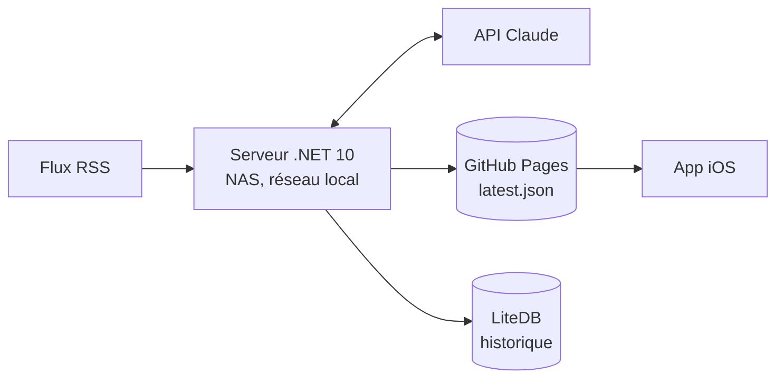

# EnBref

L'actualité du jour, lisible en deux minutes.

Chaque jour à 17 h, EnBref collecte les titres de plusieurs flux RSS, en tire un récap de sept
catégories — une à deux brèves chacune — et le publie. L'application iOS le lit au lancement.

## Comment ça marche



**Le serveur n'est pas exposé sur internet.** Il publie le récap sur GitHub Pages et les clients
lisent ce fichier statique. Le récap reste donc consultable même serveur éteint — et le NAS n'a
aucun port ouvert. C'est le choix structurant du projet ([ADR-001](docs/architecture-decision-record.md)).

## Le dépôt

| Dossier | Contenu |
|---|---|
| [`server/`](server/) | API .NET 10 : collecte, génération, publication, back-office |
| [`ios/`](ios/) | Application Swift 6 / SwiftUI |
| [`web/`](web/) | Site vitrine, HTML/CSS statique |
| [`infra/`](infra/) | Stack Docker locale |
| [`tests/`](tests/) | Tests end-to-end Bruno |
| [`docs/`](docs/) | Documentation transverse |

## Documentation

| | |
|---|---|
| [Ubiquitous language](docs/ubiquitous-language.md) | **Le vocabulaire métier. Fait autorité, y compris contre le code.** |
| [Architecture](docs/architecture.md) | Découpage, contrat publié, état réel du serveur |
| [Decision records](docs/architecture-decision-record.md) | Les décisions actées et ce qu'elles coûtent |
| [Déploiement](docs/deployment.md) | Stack locale, production, migration depuis myfanwy |

## Démarrer

```bash
cp infra/.env.local.example infra/.env.local   # renseigner OpenAiApiKey et NtfyToken
docker compose -f infra/compose.local.yml up -d --build --wait
```

L'API répond sur <http://localhost:8080/swagger>, la sonde sur `/health`.

⚠️ Laisser `GithubToken` **vide** en local : renseigné, le job de 17 h publierait sur le CDN de
production.

## État du projet

Le serveur vient d'être importé du dépôt `myfanwy` **en conservant sa structure d'origine**. Il ne
respecte pas encore les règles du projet : MediatR, découpage en modules, OpenAI au lieu de Claude,
et un modèle de récap sans catégories fixes ni brèves. Le refactor est le chantier en cours ; les
écarts sont recensés au [§ 9 du glossaire](docs/ubiquitous-language.md#9-incohérences-connues) et au
[§ 6 de l'architecture](docs/architecture.md#6-état-réel-du-serveur).

L'application iOS et le site vitrine restent à porter.
