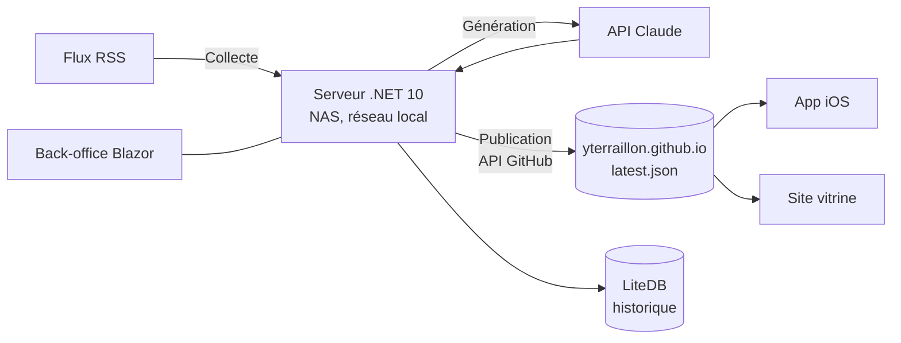

# Architecture

EnBref produit un récap quotidien de l'actualité et le met à disposition d'applications clientes.
Ce document décrit la cible ; le code de `server/` n'y est pas encore conforme (§ 6).

Le vocabulaire métier employé ici est celui de [`ubiquitous-language.md`](ubiquitous-language.md),
qui fait autorité. Les décisions actées sont dans
[`architecture-decision-record.md`](architecture-decision-record.md).

---

## 1. Vue d'ensemble

Le serveur enchaîne quatre étapes, définies au glossaire : **collecte** des titres dans les flux,
**génération** du récap par le LLM, **publication** de l'artefact, conservation dans l'**historique**.

## 2. Le principe structurant : le serveur n'est pas exposé

**Les clients ne parlent jamais au serveur.** Ils lisent un fichier statique publié sur GitHub
Pages. Le serveur pousse ce fichier via l'API GitHub, en sortie uniquement.

Les conséquences sont nombreuses et voulues :

- Le NAS n'a **aucun port ouvert sur internet** pour EnBref. Pas de reverse proxy à exposer, pas de
  certificat à renouveler pour l'API, pas de rate limiting à écrire.
- La disponibilité du récap ne dépend pas de celle du NAS. Le serveur peut être éteint, en
  maintenance ou injoignable : les clients continuent de lire le dernier récap publié.
- Le CDN GitHub absorbe la charge. Aucun dimensionnement à prévoir côté serveur, quel que soit le
  nombre d'utilisateurs.
- La surface d'attaque se réduit à un jeton GitHub sortant et à la clé du fournisseur de LLM.

**Corollaire à ne pas perdre de vue :** toute fonctionnalité qui exigerait un appel client → serveur
(historique consultable depuis l'app, personnalisation, notification push ciblée) remet ce principe
en cause et relève d'un ADR, pas d'une story.

Le **back-office** est la seule interface servie par le serveur, et elle est accessible **sur le
réseau local uniquement**. C'est ce qui lui permet de se passer d'authentification.

## 3. Découpage du serveur

### Vertical slices, sans MediatR, sans modules

Une fonctionnalité = un dossier, qui contient tout ce dont elle a besoin : son endpoint, son
handler, ses modèles de requête et de réponse, sa validation. On lit une fonctionnalité de bout en
bout sans naviguer entre quatre projets.

- **Pas de MediatR.** Les handlers sont des classes ordinaires, injectées et appelées directement
  par l'endpoint. L'indirection d'un bus en mémoire ne se justifie pas pour une application qui n'a
  ni pipeline de commandes ni découplage inter-modules à assurer.
- **Pas de modules.** `Modules/EnBref/` n'a de sens que dans un hôte qui en héberge plusieurs, ce
  qui était le cas de `myfanwy`. Ici le domaine *est* EnBref : un module unique n'est qu'un niveau
  d'indirection.
- **Pas de découpage Application / Infrastructure par projet.** Les abstractions vivent auprès du
  code qui les consomme.

### Ce qui reste partagé

Tout ce qui sert plusieurs slices, et rien d'autre : lecture des flux RSS, client LLM, publication
sur le CDN, accès LiteDB, notification ntfy, sérialisation JSON. Une abstraction ne devient
partagée que lorsqu'un **deuxième** appelant la réclame.

### Ce qui traverse les frontières

Le serveur a trois dépendances sortantes, et chacune doit rester derrière une abstraction, pour une
raison précise :

| Dépendance | Abstraction | Pourquoi |
|---|---|---|
| Flux RSS | lecteur de flux | Les sources changent ; le format aussi (RSS, Atom). |
| LLM | agent de génération | On génère avec Claude en production et les modèles GitHub pour le récap de test. Deux implémentations, un contrat. |
| Dépôt de publication | publieur | La destination peut changer ; surtout, on doit pouvoir *ne pas* publier (récap de test). |

LiteDB n'est pas dans cette liste : l'historique est un détail interne, et une abstraction de
persistance posée « au cas où » coûte plus qu'elle ne rapporte.

## 4. Le contrat publié

`latest.json` est **le** contrat d'EnBref. C'est la seule chose que les clients connaissent du
système, et la seule qui ne peut pas être modifiée unilatéralement.

Sa forme est fixée par le glossaire (§ 7) : un récap, sept catégories ordonnées, une à deux brèves
par catégorie, chaque brève portant un titre et un résumé d'une phrase.

**Toute évolution de ce contrat est une rupture** tant qu'une version de l'application iOS déployée
lit l'ancienne forme. Un champ renommé ou supprimé casse silencieusement un client Swift dont la
propriété est optionnelle : le champ devient `nil`, rien ne lève, et l'écran se vide. Un changement
de contrat exige donc un ADR et un plan de compatibilité, jamais un simple commit serveur.

`demo.json` suit exactement le même contrat : c'est ce qui lui permet de servir de test de
chargement.

## 5. Les clients

**iOS** (Swift 6 / SwiftUI, iOS 26 minimum) — charge le récap au lancement, le conserve localement,
et offre un *pull to refresh* pour aller chercher un récap plus récent. La politique de cache sera
arrêtée lors du refactor de l'app. Deux points structurants à ne pas oublier alors : GitHub Pages
sert avec un cache agressif, donc la revalidation doit s'appuyer sur `ETag` / `If-Modified-Since` ;
et l'app doit rester lisible hors ligne, puisque c'est le cas d'usage du matin dans les transports.

**Web** — site vitrine en HTML/CSS statique, sans build ni dépendances, hébergé sur l'espace OVH du
nom de domaine. Il ne consomme pas le récap.

## 6. État réel du serveur

Le code importé (`765bc3f`) vient de `myfanwy` et **ne suit aucune des règles ci-dessus**. Il sera
refactoré ; d'ici là, il ne sert pas de modèle.

| Cible | Réel |
|---|---|
| Vertical slices | `Modules/EnBref/{Application,Infrastructure}` |
| Pas de MediatR | MediatR 12, `ISender`, `IRequestHandler` |
| API Claude | Deux agents OpenAI enchaînés (rédaction, puis mise en forme JSON) |
| 7 catégories fixes, brèves | `Section { Title, Text }` libre, inventée par le LLM |
| Flux configurés | Deux URLs en dur dans `GenerateDailyRecap.Handler` |
| Historique des récaps | Seules des métriques de sections en LiteDB |

À quoi s'ajoute `GET /api/enbref/en-bref` qui **déclenche une génération complète** — un appel non
authentifié qui consomme des crédits LLM et écrase le récap publié. C'est le point à traiter en
premier.

Les écarts de vocabulaire sont recensés au § 9 du glossaire.

## 7. Ce qui reste à décider

- L'emplacement des tests (`tests/endtoend/` pour Bruno, et les tests serveur ?).
- La forme du back-office : projet Blazor séparé, ou servi par l'API ?
- La stratégie de reprise de l'historique — aujourd'hui aucune, la base démarre vide.
