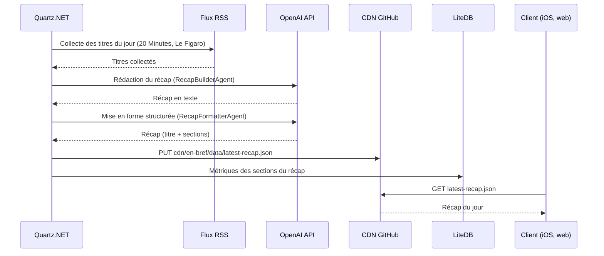

# Module EnBref

Produit le récap quotidien à partir des titres collectés dans les flux RSS et le publie sur le dépôt
CDN GitHub.

## Flux de données



## Structure

```
Modules/EnBref/
├── EnBref.Application/
│   ├── Contracts/          IRssReader, IRecapSectionMetricRepository, Constants
│   ├── Features/           GenerateDailyRecap, DisplayLatestRecap
│   └── Models/             Recap, Section, RecapSectionMetric
└── EnBref.Infrastructure/
    ├── OpenAiAgents/       RecapBuilderAgent, RecapFormatterAgent (+ prompts)
    ├── GithubCdn/          GithubCdnPublisher (écriture), GithubCdnReader (lecture)
    ├── AzureBlobStorage/   ancien stockage — conservé mais commenté dans la DI
    ├── Databases/          EnBrefDbContext, RecapSectionMetricRepository (LiteDB)
    ├── LocalStorage/       chemins de travail local / conteneur
    ├── RssReader/          lecture des flux via System.ServiceModel.Syndication
    └── ScheduledJobs/      GenerateDailyRecapJob (cron `0 0 17 * * ?`)
```

## Configuration

| Clé | Description |
|---|---|
| `OpenAiApiKey` | Clé API OpenAI (les deux agents) |
| `GithubToken` | Publication sur `yterraillon/yterraillon.github.io` |
| `NtfyToken` | Notification d'échec de génération |
| `EnBrefConnectionString` | Azure Blob — hérité, inutilisé |

## Écarts avec le glossaire

Code repris iso de myfanwy, antérieur à `docs/ubiquitous-language.md` :

| Code actuel | Terme canonique |
|---|---|
| `Section` (titre + texte libre) | `Category` contenant des `Brief` (titre + résumé) |
| `RecapSectionMetric` | relève de l'historique (`History`) |
| `latest-recap.json` | `latest.json` |
| OpenAI | API Claude |
| flux RSS en dur dans le handler | `Collecte` configurée |

Ces écarts sont consignés au § 9 du glossaire. Ne pas les reproduire dans du code neuf.
